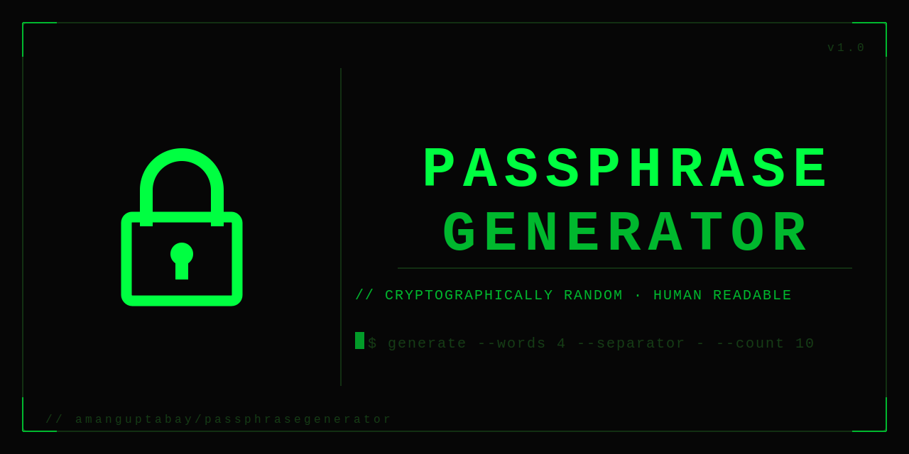

# Passphrase Generator

> **Try it live:** [amanguptabay.github.io/PassphraseGenerator](https://amanguptabay.github.io/PassphraseGenerator/)

A fast, fully client-side passphrase generator with a retro terminal aesthetic. No server, no tracking — everything runs in your browser.



---

## Features

- **Wordlist** — 6,564 common English words (4–8 characters, profanity-filtered)
- **Configurable output** — choose how many phrases, words per phrase, separator character, and digit count
- **Capitalization options** — capitalize first letter, random caps (5% per character), or both
- **Number placement** — insert digits at word edges or randomly inside words
- **Clipboard** — one-click copy per phrase, or copy all at once
- **Performance stats** — displays wordlist load, validation, and generation times
- **Retro CRT aesthetic** — scanlines, neon green, blinking cursor, ASCII banner

## Usage

Open [the live site](https://amanguptabay.github.io/PassphraseGenerator/) — no install needed.

To run locally:

```bash
git clone https://github.com/amanguptabay/PassphraseGenerator.git
cd PassphraseGenerator
# open index.html in any browser
open index.html
```

## Options

| Option | Default | Description |
|---|---|---|
| Passphrases | 5 | How many phrases to generate (1–100) |
| Words | 4 | Words per phrase (1–20) |
| Separator | `-` | Character placed between words |
| Digits | 2 | Random numbers inserted per phrase (0–10) |
| Numbers in middle | off | Place digits inside words instead of at edges |
| Capitalize | on | Uppercase the first letter of each word |
| Random caps | off | Randomly uppercase ~5% of letters |

## Project Structure

```
PassphraseGenerator/
├── index.html              # App HTML + embedded CSS
└── static/
    ├── app.js              # All application logic (vanilla JS)
    ├── words.txt           # 6,564-word wordlist
    ├── favicon.svg         # Lock icon (source)
    ├── favicon.png         # Generated favicon
    ├── favicon.jpg         # Generated favicon (JPG variant)
    ├── social-preview.svg  # OG image (source)
    ├── social-preview.png  # Generated OG image
    └── build-assets.py     # Converts SVGs → PNGs + favicon.jpg
```

## Regenerating Image Assets

Requires Python 3 with `cairosvg` and `Pillow`:

```bash
pip install cairosvg Pillow
python3 static/build-assets.py
```

This converts every `.svg` in `static/` to a `.png` and produces `favicon.jpg` at 64×64.

## Tech

Pure HTML, CSS, and vanilla JavaScript — zero dependencies, zero build step, zero telemetry.
